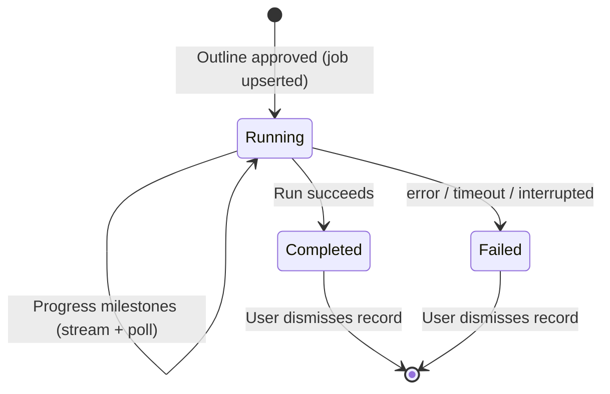
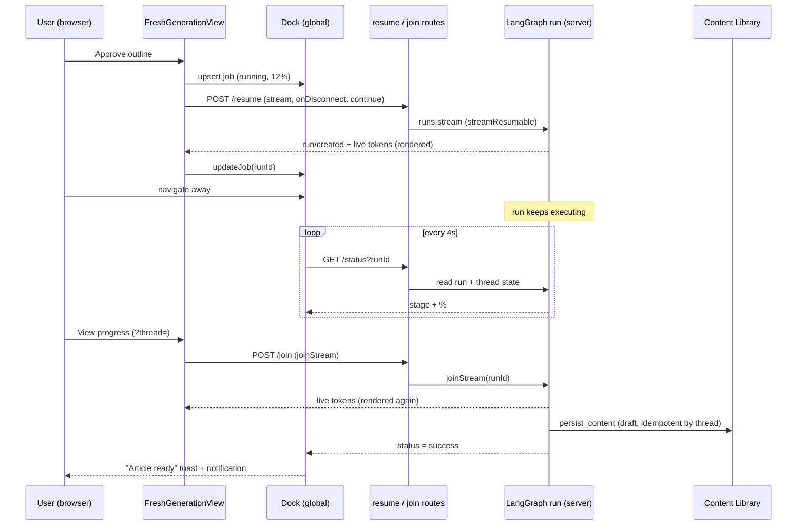

# Background Processing During Generation

This document explains, end to end (frontend **and** backend), how Rext lets a
user start an article generating and then keep using the rest of the product —
Content Calendar, Brand Voice, Integrations, another tab, a refresh, or even
closing the tab — while the article keeps generating, shows up **live** when they
return, and lands in the **Content Library automatically** when it finishes.

It also covers the global progress bar, cross-tab sync, completion
notifications, article restoration, credits, and durability.

---

## 1. Short answer

Rext uses **no BullMQ, Celery, Redis, or browser-worker queue** for this.

There are two different "jobs":

1. A **LangGraph run** performs the real generation on the server. It also
   spends credits and — as its final node — **saves the finished article to the
   Content Library**.
2. A **Zustand background-job record** tracks that run in the browser so the UI
   can show progress and notifications. It generates nothing; it only stores the
   thread id, run id, stage, and percentage.

The run is **owned by the LangGraph server**, not by a React component's stream
request. That single fact — plus two flags on every run — is what makes leaving
the page safe:

- `onDisconnect: "continue"` — an SSE consumer disconnecting (navigation, tab
  close) does **not** cancel the run.
- `streamResumable: true` — the run's event stream can be **re-joined** later, so
  returning to a running generation shows tokens live instead of a skeleton.

```text
React screen  → asks LangGraph to start / re-join work
LangGraph     → owns and executes the real generation (+ saves the result)
Zustand/LS    → remembers what the browser should display
Next.js route → connects the browser to LangGraph (stream / resume / join / status)
```

---

## 2. Scope: interactive vs background phase

**Interactive phase** (needs user input — streamed to the screen directly):
keyword analysis → content type → topic suggestions → outline → outline review.

**Background phase** (safe to run while the user is elsewhere): writing the
article → final structured content → readability → on-page SEO → E-E-A-T trust →
**persist to library**. This begins when the user **approves the outline**.

---

## 3. Ownership boundary

```text
React component (FreshGenerationView):
    Starts the run, renders it live, and can re-join it later

Zustand + localStorage:
    Remembers what the browser should display (per-tab UI state, synced)

Next.js routes:
    Bridge the browser to LangGraph (stream / resume / join / status / threads)

LangGraph server:
    Owns and executes the real generation, and runs the persist node
```

---

## 4. How generation used to be cancelled — and why it isn't now

The generation screen streams via an `AbortController`, and its unmount cleanup
aborts the active stream:

```ts
const abortControllerRef = useRef<AbortController | null>(null);
useEffect(() => () => cancelStream(), []); // abort on unmount
```

That is correct for a **UI-owned** stream. The problem was that the final
article generation used to be owned by that stream, so navigating away aborted
the generation.

**Now the run is server-owned.** Every streamed run is created with
`onDisconnect: "continue"`, so the run keeps executing even after the browser's
SSE connection drops. The frontend aborting only stops *reading*; it never
cancels the run. The run can be re-joined later with the thread id + run id.

> Note: the `resume` route also has an unused `background: true` branch that does
> a detached `runs.create`. The live flow below does **not** use it — it streams
> and relies on `onDisconnect: "continue"` for survival. The branch is kept as a
> harmless API capability.

---

## 5. Frontend flow — starting generation (live on the page)

Orchestration lives in
[`components/generate-content/fresh-generation-view.tsx`](components/generate-content/fresh-generation-view.tsx).

### Step 1 — user approves the outline

The approve handler calls `startBackgroundWorkflow(...)` with the approve payload
(action `approve`, tone, audience, selected internal links, brand-voice choice).

### Step 2 — guard against duplicate / unfunded starts

```ts
if (!threadId || !ensureCreditsToContinue()) return;
// resumeWorkflow additionally guards streamBusyRef to block double-starts
```

### Step 3 — register the tracking record immediately

Before any server response, a `BackgroundGenerationJob` is upserted so the dock
can track it the moment the user leaves:

```ts
upsertBackgroundJob({
  threadId, workspaceId, workspaceSlug,
  title, keyword: primaryKeyword,
  status: "running", stage: "Drafting your article", progress: 12,
  createdAt: now, updatedAt: now, resultUrl, completionNotified: false,
});
```

### Step 4 — stream live (server-owned)

`startBackgroundWorkflow` delegates to `resumeWorkflow`, which opens the SSE
stream and renders tokens live — the article appears as it's written, with the
pipeline and research sidebar updating:

```ts
streamFromSSE(`/api/generate/${threadId}/resume`, {
  payload, streamMode: ["updates","messages","custom"], streamSubgraphs: true,
  onDisconnect: "continue",   // ← run survives navigation
}, signal);
```

The `resume` route emits a `run/created` SSE event; `processStream` captures the
`run_id` from it and calls `updateBackgroundJob(threadId, { runId, ... })`. The
user is **not** navigated away — they keep watching live, and the
"Generating in the background — you can leave this page" banner tells them it's
safe to leave.

---

## 6. Leaving the page (the background part)

1. The user navigates to another feature / another tab / closes the tab.
2. The SSE reader aborts locally, but the **LangGraph run keeps executing**.
3. The **global dock** (mounted in `PageLayout`, present on every workspace page)
   takes over tracking — it polls `/status` and updates the record independently
   of the generation screen.

---

## 7. Returning to a running generation — re-join the live stream

Clicking **View progress** / **Open article** / the notification navigates to:

```text
/w/{workspaceSlug}/generate_content?thread={threadId}
```

[`app/w/[workspaceSlug]/generate_content/page.tsx`](app/w/[workspaceSlug]/generate_content/page.tsx)
reads `?thread=` and passes `backgroundThreadId` to `FreshGenerationView`, which
enters **restore mode**:

1. `GET /api/generate/{threadId}/status?includeState=true` to find the run + its
   `runId`.
2. **Run still in progress** → set the token target to `content`, open the join
   route, and pipe it through the same `processStream` used on-page → **the
   article renders live**, not a skeleton:

   ```ts
   streamFromSSE(`/api/generate/${threadId}/join`, { runId }, signal);
   ```

   The join route calls `client.runs.joinStream(threadId, runId, {
   cancelOnDisconnect: false })` (works because the run is `streamResumable`).
3. **Run already succeeded** → `hydrateFromBackgroundState` restores thread id,
   keyword, outline, final content, markdown/HTML body, readability, trust, and
   on-page SEO, then shows the editor.
4. **Run failed / timed out** → a clear restore error with "Start a new article".
5. When the joined stream ends, `/status` is re-checked to hydrate the final
   article or catch a terminal state.

---

## 8. Browser tracking store

[`stores/background-generation-store.ts`](stores/background-generation-store.ts) —
Zustand + `persist` (localStorage) + devtools. Storage key:
`rext-background-generations`.

```ts
interface BackgroundGenerationJob {
  threadId: string;
  runId?: string;
  workspaceId?: string;
  workspaceSlug: string;
  title: string;
  keyword: string;
  status: "queued" | "running" | "completed" | "failed";
  stage: string;
  progress: number;
  createdAt: string;
  updatedAt: string;
  resultUrl: string;
  error?: string;
  completionNotified?: boolean;
}
```

| Field | Purpose |
| --- | --- |
| `threadId` | The persisted LangGraph conversation + state |
| `runId` | The exact background execution (lets the poller query the right run) |
| `workspaceSlug` | Which workspace shows the job |
| `status` / `stage` / `progress` | Simplified lifecycle / user-facing text / % |
| `resultUrl` | Reopens and restores the article (`?thread=`) |
| `completionNotified` | Prevents repeated completion notifications |

**Operations:** `upsertJob` (one record per thread), `updateJob` (patch +
`updatedAt`), `removeJob` (dismiss UI only — never cancels the run), `mergeJobs`
(cross-tab: newest `updatedAt` wins), `pruneFinishedJobs` (drop finished records
after 24h; queued/running are kept).

**Limits (UI storage only, not server retention):**
`MAX_JOBS = 8`, `FINISHED_JOB_TTL_MS = 24h`.

---

## 9. Cross-tab synchronization

The dock listens for the browser `storage` event:

```ts
window.addEventListener("storage", handleStorage);
```

When another tab writes `rext-background-generations`, the receiving tab parses
it and calls `mergeJobs`, keeping the newest version of each job. This is pure UI
sync — **LangGraph** keeps the generation alive, the `storage` event only keeps
progress displays consistent. No WebSocket / BroadcastChannel needed.

---

## 10. Global progress bar (the "dock")

[`components/background-generation-dock.tsx`](components/background-generation-dock.tsx),
mounted in [`components/page-layout.tsx`](components/page-layout.tsx), so it
appears across workspace pages (Content Calendar, Brand Voice, Integrations,
Knowledge, Media, Members, …).

- **Active job:** title, stage, progress track, %, `View progress`, count of
  other active jobs.
- **Completed:** success icon, "Article ready", `Open article`, dismiss.
- **Failed:** error icon, message, `View details`, dismiss.
- **A11y:** `role="status"` + `aria-live="polite"`; the loading icon respects
  reduced-motion.

### Polling

```ts
const intervalId = window.setInterval(checkJobs, 4000); // every 4s
```

- Polls jobs with status `queued` / `running`, calling
  `GET /api/generate/{threadId}/status?runId={runId}`.
- On `visibilitychange` → refreshes immediately instead of waiting.
- **Run-discovery grace period** `RUN_DISCOVERY_GRACE_MS = 15_000` — waits before
  guessing a run for a job that has no `runId` yet, so it doesn't grab the prior
  interactive run.
- **Progress never goes backwards:** `Math.max(latestJob.progress, payload.progress ?? 8)`.

---

## 11. How percentages are calculated

Milestone-based, not a timer or token count.
[`lib/generate-content/background-progress.ts`](lib/generate-content/background-progress.ts)
combines run status, active graph nodes, persisted final content, persisted
review results, and persisted errors.

| % | Stage | Evidence |
| ---: | --- | --- |
| 8 | Queued for generation | run pending |
| 24 | Preparing your article | run active, no specific node yet |
| 42 | Drafting your article | `generate_content` / `content_engine` active |
| 74 | Reviewing SEO and readability | final content exists or a review node active |
| 84 | Running quality checks | 1 review result persisted |
| 90 | Running quality checks | 2 review results persisted |
| 96 | Running quality checks | all 3 review results persisted, run finishing |
| 100 | Article ready | run status `success` |

The three review results: readability metrics, on-page SEO metrics, trust score.
Statuses `error` / `timeout` / `interrupted` (or a persisted `content.error`) map
to a **failed** job.

---

## 12. Status lifecycle



| LangGraph status | Frontend status |
| --- | --- |
| `pending` | `queued` |
| `running` | `running` |
| `success` | `completed` |
| `error` / `timeout` / `interrupted` | `failed` |

---

## 13. Completion notifications

When a job first becomes `completed` or `failed`, the dock sets
`completionNotified: true`, adds a notification, and shows a Sonner toast with an
action that opens the article / failure details. Notification metadata:

```ts
{ href: job.resultUrl, threadId: job.threadId, kind: "content_generation" }
```

[`components/notifications-drawer.tsx`](components/notifications-drawer.tsx)
recognizes this and provides an **Open** action. `completionNotified` prevents
repeat toasts from the same persisted state.

---

## 14. Persisting to the Content Library (backend)

Previously nothing wrote the finished article to the library automatically — it
required a manual **Save** in the editor, so a backgrounded article was lost.
Now the **graph saves it as its final step**.

### Graph wiring
[`src/flow/engines/content/content_engine.py`](../rext-backend/src/flow/engines/content/content_engine.py):

```text
… → generate_content → review_content → persist_content → END
```

### The persist node
[`src/flow/engines/content/generation/persist_content.py`](../rext-backend/src/flow/engines/content/generation/persist_content.py):

- Reads `state.content.final_content` + `state.content.review.*`, plus
  `user_id` / `workspace_id` from `serp_payload` and `thread_id` from the run
  config.
- Writes the article to the Content table as a **draft** via
  `ContentService.create_content`, tagged with `langgraph_thread_id`.
- **Idempotent by `langgraph_thread_id`** — re-runs update the same row.
- **Never throws upward** — any failure is logged and swallowed so persistence
  can't break the run.

Because this runs server-side, the article appears in the library **whether or
not any browser tab was watching**.

### Idempotent create
[`src/services/content_service.py`](../rext-backend/src/services/content_service.py) —
`create_content` reconciles to the existing row when `langgraph_thread_id`
matches (updates instead of duplicating or erroring on title). The editor's
manual **Save/Publish** now sends `langgraph_thread_id` too, so a manual save
reconciles to the same auto-saved row instead of creating a duplicate
(`draft → published` is an allowed transition).

---

## 15. Credits

Credits are deducted **server-side, inside the graph nodes** (e.g. the content
stage deducts up front when `generate_content` runs). This is independent of the
browser — once the run starts, the work and the charge happen on the server.
Backgrounding doesn't change what's charged; and because `persist_content` now
always saves the result, the spend reliably produces a stored article.

---

## 16. Durability (dev vs prod)

- Runs survive **client disconnect** on any runtime (`onDisconnect: "continue"`).
- Surviving a **server restart** requires **LangGraph Server / Platform** with
  the Postgres checkpointer + store configured in `langgraph.json`.
- `langgraph dev` is the **in-memory** runtime — fine for testing backgrounding,
  but in-flight runs are lost on restart.

---

## 17. Full sequence (happy path)



---

## 18. Common scenarios

- **Navigate to Content Calendar:** generation screen unmounts, local SSE
  aborts, the run is unaffected (LangGraph owns it); the dock in `PageLayout`
  keeps polling and showing progress.
- **Switch tabs:** run continues; other tabs get localStorage updates; a tab
  refreshes status when it becomes visible.
- **Refresh:** Zustand rehydrates from localStorage, active jobs resume polling,
  the bar returns.
- **Close all tabs:** browser polling stops, the run continues; on reopen in the
  same profile the record is restored and status is re-queried.
- **Open the completed article:** `?thread=` → persisted thread state → editor
  renders the restored (and already-saved) article.

---

## 19. What this is NOT

Not BullMQ, Celery, a Redis queue, a service worker, a Web Worker, a
browser-only generation, a WebSocket progress system, or OS push. LangGraph is
the execution/run-management layer; Zustand is only the browser tracking layer.

---

## 20. Limitations

- **Browser-local tracking:** the record lives in localStorage, so it isn't
  automatically visible on another device (the run exists server-side; a
  server-side job-list endpoint would be needed to discover it elsewhere).
- **Notifications require Rext open:** toasts/notifications are produced by the
  frontend; there is no email / browser-push / Slack / mobile push.
- **Milestone %:** represents completed pipeline stages, so it can jump.
- **No user-facing cancel:** dismissing a record only hides the UI; cancelling
  the run would need a route calling LangGraph's run-cancel API.
- **UI retention:** 8 recent jobs, finished expire after 24h (UI-only limits).

---

## 21. Failure handling

- **Stream/join fails to start:** the job is marked `failed`, error stored,
  local loading cleared; the restore path re-checks status to reconcile.
- **Status poll temporarily fails:** the dock keeps the last known state (a
  transient network error is not a generation failure); the next poll retries.
- **LangGraph error/timeout:** job marked `failed`, notification shown.
- **Success without final content:** treated as terminal — "Generation finished,
  but the article result was unavailable." (avoids an endless loading state).
- **`persist_content` fails:** logged and swallowed; the run still succeeds (the
  article can still be saved manually from the editor).

---

## 22. Debugging guide

**Browser tracking record:**

```js
JSON.parse(localStorage.getItem("rext-background-generations"));
// check threadId, runId populated, status, progress, updatedAt changing, resultUrl
```

**Start request** (DevTools → Network): `POST /api/generate/{threadId}/resume`
returns an SSE stream; early in the stream you should see a
`{ "event": "run/created", "data": { "run_id": … } }` chunk.

**Progress polling:** repeated `GET /api/generate/{threadId}/status?runId={runId}`:

```json
{ "threadId": "…", "run": { "id": "…", "status": "running" },
  "progress": 42, "stage": "Drafting your article" }
```

**Re-join (return to a running run):**
`POST /api/generate/{threadId}/join` with body `{ "runId": "…" }` — an SSE
stream of the live run.

**Restore/hydrate:** `GET /api/generate/{threadId}/status?includeState=true` —
success state contains `state.values.content.final_content` and
`state.values.content.review`.

**Library persistence (backend logs):** `persist_content: saved article <id> for
thread <threadId>`. If missing, check `final_content`/thread id in state and the
`langgraph_thread_id` column.

**Bar not appearing:** page uses `PageLayout`; store has the job; `hasHydrated`
true; job matches current workspace; not pruned/dismissed.

**Stuck at queued:** run/created arrived and `runId` stored; `/status` returns
`pending`/`running`; session authenticated; LangGraph reachable via
`LANGGRAPH_API_URL`.

---

## 23. Tests

Frontend store tests:
[`__tests__/background-generation-store.test.ts`](__tests__/background-generation-store.test.ts)
(one job per thread, persistence, cross-tab merge, newest-wins).
Progress tests:
[`__tests__/background-generation-progress.test.ts`](__tests__/background-generation-progress.test.ts)
(queued, drafting, review milestones, error, success).

```bash
pnpm exec jest --runInBand \
  __tests__/background-generation-store.test.ts \
  __tests__/background-generation-progress.test.ts
pnpm exec tsc --noEmit --pretty false
pnpm build
```

---

## 24. File-by-file map

### Frontend (`rext-admin`)

| File | Responsibility |
| --- | --- |
| `components/generate-content/fresh-generation-view.tsx` | Starts the run (live stream), re-joins a running run, restores completed state |
| `stores/background-generation-store.ts` | Persists + syncs browser tracking records |
| `components/background-generation-dock.tsx` | Polls active jobs, renders the top bar, creates notifications |
| `components/page-layout.tsx` | Mounts the bar across workspace pages |
| `components/notifications-drawer.tsx` | Opens article links from generation notifications |
| `app/w/[workspaceSlug]/generate_content/page.tsx` | Reads `?thread=` and enters restore mode |
| `app/api/generate/threads/route.ts` | Creates a durable thread |
| `app/api/generate/[threadId]/stream/route.ts` | Initial generation stream (`onDisconnect: continue`, `streamResumable`) |
| `app/api/generate/[threadId]/resume/route.ts` | Resume/approve stream; emits `run/created` |
| `app/api/generate/[threadId]/join/route.ts` | Re-joins a running run's live stream (`joinStream`, `cancelOnDisconnect: false`) |
| `app/api/generate/[threadId]/status/route.ts` | Run status, derived progress, optional thread state |
| `lib/generate-content/background-progress.ts` | LangGraph state → user-facing milestones |

### Backend (`rext-backend`)

| File | Responsibility |
| --- | --- |
| `src/flow/engines/content/content_engine.py` | Graph wiring incl. `review_content → persist_content → END` |
| `src/flow/engines/content/generation/persist_content.py` | Final node — auto-saves the article to the library (idempotent by thread) |
| `src/services/content_service.py` | `create_content` idempotent by `langgraph_thread_id` |
| `src/api/schema/content_schema.py` | `langgraph_thread_id` on `ContentCreate` |
| `langgraph.json` | Checkpointer + store config = server-side run durability |

---

## 25. Mental model

```text
The React screen asks LangGraph to start (or re-join) work.
LangGraph owns the work, and its last step saves the article to the library.
The browser remembers the run id and, from any tab, asks how it's going.
When it finishes, the browser restores the saved state into the editor —
and the article is already in the Content Library.
```

That separation is what lets the user keep using Rext without staying on the
generation screen.
